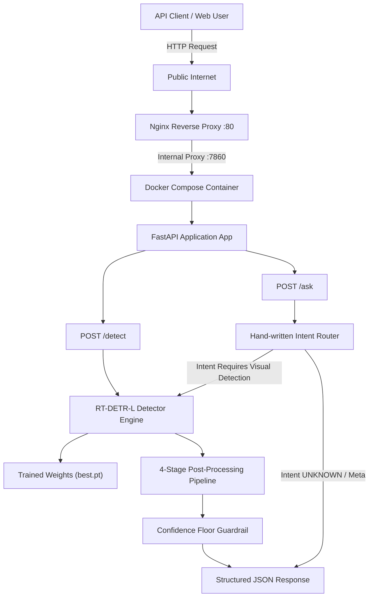
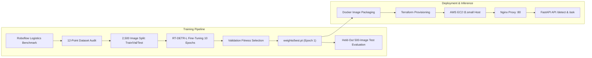

# 📦 Autonomous Logistics Object Detection & Reasoning API

<div align="center">


**End-to-End Computer Vision + Natural Language Reasoning API for Industrial Logistics**  
*Author: Aadithya R | Track: Computer Vision + Applied ML Engineering*

[🌐 Live Public API](http://13.233.255.22) • [📄 Swagger Documentation](http://13.233.255.22/docs) • [📄 Engineering Memo](docs/MEMO.md) • [📊 Evaluation Details](docs/EVALUATION.md) • [🚀 AWS Deployment Guide](docs/AWS_DEPLOYMENT.md)

</div>

---

## 1. Overview

The **Autonomous Logistics Object Detection & Reasoning API** is a domain-specific computer vision and spatial reasoning system engineered for industrial warehouse operations. Built around an **RT-DETR-L (Real-Time Detection Transformer Large)** backbone, the system detects critical material-handling assets and provides a deterministic, hand-written natural-language reasoning layer for inventory query answering.

Unlike generic COCO object detectors, this project addresses domain-specific logistics challenges—such as non-standard industrial packaging, severe box stacking occlusion, spatial partitioning of multi-container bays, and visual texture similarities between wooden pallets and crates.

The full pipeline—from dataset curation and fine-tuning to post-processing guardrails, containerized FastAPI deployment, Nginx reverse proxying, and Terraform infrastructure-as-code—is deployed live on **AWS EC2** for 24/7 autonomous availability.

---

## 2. Problem Statement

Modern logistics hubs rely on real-time visual perception to monitor inventory throughput, verify cargo loading, and prevent industrial vehicle collisions. Standard pre-trained vision models trained on consumer datasets (e.g., COCO) lack specialized categories essential for supply chain operations—such as `freight container`, `wood pallet`, and `cardboard box`.

### Core Engineering Challenges:
1. **Custom Industrial Categories**: Detecting non-COCO logistics objects in densely packed environments.
2. **Sub-Region Duplicate Detections**: Preventing nested sub-bounding boxes inside large cargo containers.
3. **Cross-Class Ambiguity**: Resolving multi-head prediction overlaps between visually similar objects (e.g., trucks vs. forklifts).
4. **Hallucination-Free Question Answering**: Providing reliable visual Q&A without relying on un-auditable, heavy LLM frameworks.

---

## 3. Key Features

- **Real-Time Detection Backbone**: Fine-tuned **RT-DETR-L** transformer backbone optimized for 640×640 industrial imagery.
- **4-Stage Post-Processing Guardrail**: Class-aware NMS, same-class IoS containment suppression, cross-class high-IoU suppression, and boundary artifact suppression.
- **Deterministic Reasoning Engine**: Pure Python intent-routing layer (`app/reasoning.py`) supporting 6 distinct query intents (`COUNT`, `PRESENCE`, `LIST`, `SPATIAL`, `MOST_COMMON`, `UNKNOWN`).
- **Confidence Floor Guardrail**: Strictly returns explicit `"insufficient information"` responses when detection evidence falls below threshold ($0.25$).
- **Zero Heavy Agent Frameworks**: Zero dependency on LangChain, LangGraph, CrewAI, AutoGen, or AutoML no-code black boxes.
- **Production AWS Infrastructure**: Deployed via **Terraform** on an **AWS EC2** instance behind an **Nginx** reverse proxy and **Docker Compose**.

---

## 4. Supported Object Classes

The detector supports **5 target categories**, including **3 custom non-COCO industrial categories**:

| Class ID | Class Name | Category Type | Description |
| :---: | :--- | :---: | :--- |
| **0** | `cardboard box` | **Non-COCO** | Standard parcel packaging, e-commerce cartons, and stacked boxes. |
| **1** | `forklift` | Standard | Heavy industrial material-handling vehicles. |
| **2** | `freight container` | **Non-COCO** | Intermodal shipping containers (20ft/40ft TEUs) and ocean cargo units. |
| **3** | `wood pallet` | **Non-COCO** | Structural wooden bases used for unit load consolidation. |
| **4** | `truck` | Standard | Commercial transport vehicles, semi-trucks, and warehouse bay delivery trucks. |

---

## 5. System Architecture



---

## 6. End-to-End Workflow



---

## 7. Dataset & Split Composition

- **Dataset Source**: Constructed from Roboflow Universe benchmark dataset [`large-benchmark-datasets/logistics-sz9jr`](https://universe.roboflow.com/large-benchmark-datasets/logistics-sz9jr) (Version 1, CC BY 4.0).
- **Curated Dataset**: Exactly **2,500 balanced images** (500 per class), verified via a 12-point programmatic audit script ([`scripts/verify_dataset.py`](file:///C:/Aadithya%20projects/logistics-object-detection/scripts/verify_dataset.py)).

### Dataset Split Distribution

| Split | Percentage | Images Per Class | Total Images | Primary Purpose |
| :--- | :---: | :---: | :---: | :--- |
| **Train** | 60% | 300 | **1,500** | Model fine-tuning and weight optimization. |
| **Validation** | 20% | 100 | **500** | Model checkpoint selection (`best.pt`) during training. |
| **Test (Held-Out)** | 20% | 100 | **500** | Untouched local benchmark evaluation. |
| **Total** | 100% | 500 | **2,500** | Programmatically verified dataset benchmark. |

> [!NOTE]
> **Held-Out Test Set Role**: The 500-image test set was kept completely isolated from model training and hyperparameter tuning. It serves strictly as our local evaluation benchmark. It is **not** claimed to represent the hidden evaluator test set.

---

## 8. RT-DETR Training & Hyperparameters

- **Model Backbone**: RT-DETR-L (`rtdetr-l.pt`), initialized with COCO-pretrained weights.
- **Framework**: Ultralytics RT-DETR implementation (Faithful Real-Time Detection Transformer architecture).
- **Hardware Host**: NVIDIA GeForce RTX 3050 6GB Laptop GPU.
- **Configured Epochs**: 50 configured epochs (10 completed during fine-tuning run).
- **Training Duration**: **3,235.52 seconds (~53.93 minutes)** for the 10 completed epochs.
- **Hyperparameter Configuration**:
  - `imgsz`: $640 \times 640$
  - `batch`: 2
  - `optimizer`: AdamW
  - `lr0`: $1 \times 10^{-4}$
  - `weight_decay`: $5 \times 10^{-4}$
  - `seed`: 42
- **Data Augmentation Settings**:
  - `mosaic`: 1.0, `hsv_h`: 0.015, `hsv_s`: 0.7, `hsv_v`: 0.4
  - `translate`: 0.1, `scale`: 0.5, `fliplr`: 0.5, `erasing`: 0.4

### Model Checkpoint Selection
The deployed checkpoint [`weights/best.pt`](file:///C:/Aadithya%20projects/logistics-object-detection/weights/best.pt) corresponds to **Epoch 1** (`epoch0.pt`, SHA256: `455f8478266cbd48...`), selected by Ultralytics validation fitness (`best_fitness = 0.40391`). The training script completed 10 full epochs out of 50 configured.

---

## 9. Held-Out Test Set Evaluation Results

Evaluated on the untouched **500-image held-out test split** (`python scripts/evaluate.py --weights weights/best.pt`):

### Overall Benchmark Performance

| Metric | Value | Percentage | Description |
| :--- | :---: | :---: | :--- |
| **mAP@0.5** | **0.5040** | **50.40%** | Mean Average Precision at IoU threshold $\ge 0.50$. |
| **mAP@0.5:0.95** | **0.3408** | **34.08%** | COCO-standard mAP averaged across IoU $0.50 - 0.95$. |
| **Precision** | **0.5734** | **57.34%** | $\text{True Positives} / (\text{True Positives} + \text{False Positives})$. |
| **Recall** | **0.4873** | **48.73%** | $\text{True Positives} / (\text{True Positives} + \text{False Negatives})$. |

### Per-Class Test Performance

| Class Name | Class ID | Precision | Recall | mAP@0.5 | mAP@0.5:0.95 |
| :--- | :---: | :---: | :---: | :---: | :---: |
| **`wood pallet`** | 3 | **0.7850** | **0.6600** | **0.6708** | **0.4700** |
| **`truck`** | 4 | **0.5780** | **0.5870** | **0.6515** | **0.4200** |
| **`forklift`** | 1 | **0.7000** | **0.5280** | **0.6151** | **0.3610** |
| **`cardboard box`** | 0 | **0.6680** | **0.2830** | **0.4144** | **0.3170** |
| **`freight container`** | 2 | **0.1360** | **0.3790** | **0.1683** | **0.1360** |
| **Overall (Mean)** | — | **0.5734** | **0.4873** | **0.5040** | **0.3408** |

### Evaluation Metrics Explanation:
- **mAP@0.5 (50.40%)**: Evaluates localization under relaxed spatial tolerance ($\text{IoU} \ge 0.50$). Rigid industrial machinery (`wood pallet`, `truck`, `forklift`) scored strongly ($61.5\% - 67.1\%$).
- **mAP@0.5:0.95 (34.08%)**: Evaluates strict bounding box boundary precision across IoU thresholds $0.50$ to $0.95$.
- **Precision (57.34%)**: Measures false positive resistance.
- **Recall (48.73%)**: Measures object detection coverage. `cardboard box` recall ($28.3\%$) was impacted by dense box clustering.

---

## 10. Evaluation Artifacts

All evaluation artifacts generated during testing are committed and accessible in the repository:

- [`artifacts/evaluation_results.json`](file:///C:/Aadithya%20projects/logistics-object-detection/artifacts/evaluation_results.json): Full machine-readable test evaluation metrics.
- [`artifacts/confusion_matrix.png`](file:///C:/Aadithya%20projects/logistics-object-detection/artifacts/confusion_matrix.png): Raw confusion matrix on held-out test split.
- [`artifacts/confusion_matrix_normalized.png`](file:///C:/Aadithya%20projects/logistics-object-detection/artifacts/confusion_matrix_normalized.png): Normalized confusion matrix visualization.
- [`artifacts/sample_predictions/`](file:///C:/Aadithya%20projects/logistics-object-detection/artifacts/sample_predictions/): Qualitative prediction overlays on test set images.
- [`runs/eval/test_eval/`](file:///C:/Aadithya%20projects/logistics-object-detection/runs/eval/test_eval/): Full evaluation outputs including PR curves (`BoxPR_curve.png`), F1 curves (`BoxF1_curve.png`), and prediction outputs (`predictions.json`).

---

## 11. Detection Pipeline & Post-Processing Guardrails

Raw object detector outputs undergo a 4-stage post-processing pipeline in [`app/detector.py`](file:///C:/Aadithya%20projects/logistics-object-detection/app/detector.py):

```
Raw RT-DETR Detections
         │
         ▼
[Stage 1: Class-Aware NMS] (batched_nms, IoU = 0.45)
         │
         ▼
[Stage 2: Same-Class Containment Suppression] (IoS >= 0.65)
         │
         ▼
[Stage 3: Cross-Class High-IoU Suppression] (IoU >= 0.80)
         │
         ▼
[Stage 4: Boundary Artifact Suppression] (conf < 0.30 & inside_ratio < 0.50)
         │
         ▼
Final Filtered Detections
```

### Post-Processing Thresholds:
1. **Class-Aware NMS** ($\text{IoU} = 0.45$): Removes overlapping bounding boxes belonging to the *same* class.
2. **Same-Class IoS Containment Suppression** ($\text{IoS} \ge 0.65$): Computes Intersection-over-Smaller ($\text{IoS} = \frac{\text{Area}(A \cap B)}{\min(\text{Area}(A), \text{Area}(B))}$). Suppresses smaller sub-boxes contained inside a larger box of the same class.
3. **Cross-Class High-IoU Duplicate Suppression** ($\text{IoU} \ge 0.80$): Suppresses lower-confidence boxes of *different* classes sharing near-identical coordinates.
4. **Boundary Artifact Suppression** ($\text{conf} < 0.30$, $\text{inside\_ratio} < 0.50$): Suppresses low-confidence phantom boxes extending $>50\%$ outside the image boundary.

---

## 12. Natural Language Reasoning & Intent Routing

The reasoning layer ([`app/reasoning.py`](file:///C:/Aadithya%20projects/logistics-object-detection/app/reasoning.py)) provides deterministic question answering over detector outputs without LLM latency or non-deterministic hallucinations.

### Supported Intents & Routing Rules

| Intent Label | Natural Language Keyword Patterns | Target Action |
| :--- | :--- | :--- |
| **`COUNT`** | *"how many", "number of", "count of"* | Counts matching objects of specified target class. |
| **`PRESENCE`** | *"is there", "are there", "does the image contain"* | Verifies existence of specified target class. |
| **`LIST`** | *"what objects", "which objects", "identify"* | Returns summary list of all detected classes. |
| **`SPATIAL`** | *"near", "next to", "left of", "right of", "above", "below"* | Calculates box centroids, IoU, and relative position vector. |
| **`MOST_COMMON`**| *"most common", "dominant object", "most frequent"* | Computes class frequency distribution. |
| **`UNKNOWN`** | Non-matching or conversational queries | Bypasses detector; returns capability boundary response. |

---

## 13. Confidence Guardrail

To prevent confident hallucinations when object detections are missing or weak, `app/reasoning.py` enforces a **Three-Tier Confidence Guardrail**:

- **High Confidence**: Maximum target class confidence $\ge 0.50$.
- **Medium Confidence**: Maximum target class confidence $0.25 - 0.50$.
- **Low Confidence**: Confidence $< 0.25$ (below floor) or target object missing.

### Concrete "Insufficient Information" Example
When a user asks `POST /ask` about a target class (`wood pallet`) that is not present or detected below confidence floor ($0.25$), the API explicitly responds:

```json
{
  "answer": "I could not confidently detect any wood pallet in the image. Insufficient information to answer confidently.",
  "used_detector": true,
  "confidence": "low",
  "detections": null,
  "intent": "COUNT"
}
```

---

## 14. API Reference & Interface Examples

- **Live Base URL**: `http://13.233.255.22`
- **Swagger Documentation**: `http://13.233.255.22/docs`

### Available Endpoints
- `GET /health`: Liveness probe returning `{"status": "ok", "version": "1.0.0", "model_loaded": true}`.
- `GET /classes`: Returns list of 5 supported categories.
- `POST /detect`: Accepts image file upload, returns structured bounding box detections.
- `POST /ask`: Accepts image file upload + `question` string, returns natural language reasoning response.

### cURL Examples

```bash
# 1. Health Check
curl -X GET "http://13.233.255.22/health"

# 2. Object Detection
curl -X POST "http://13.233.255.22/detect" \
  -F "file=@sample.jpg"

# 3. Question Answering
curl -X POST "http://13.233.255.22/ask" \
  -F "file=@sample.jpg" \
  -F "question=How many freight containers are visible?"
```

### Response Schemas

#### `/detect` Response Example:
```json
{
  "objects": [
    {
      "class": "freight container",
      "confidence": 0.5321,
      "bbox": {
        "x1": 76.53,
        "y1": 23.41,
        "x2": 589.8,
        "y2": 597.75
      }
    }
  ],
  "num_detections": 1,
  "image_size": [640, 640]
}
```

#### `/ask` Response Example:
```json
{
  "answer": "There is 1 freight container visible.",
  "used_detector": true,
  "confidence": "high",
  "detections": [
    {
      "class": "freight container",
      "confidence": 0.5321,
      "bbox": {
        "x1": 76.53,
        "y1": 23.41,
        "x2": 589.8,
        "y2": 597.75
      }
    }
  ],
  "intent": "COUNT"
}
```

---

## 15. Known Failure Cases & Root Cause Analysis

### Case 1: Same-Class Internal Sub-Region Duplicates
- **Symptom**: A single large freight container produced up to 6 internal sub-box container detections.
- **Root Cause**: Small sub-boxes inside a large container have $\text{IoU} < 0.03$ relative to the outer box, allowing sub-boxes to survive standard IoU NMS.
- **Mitigation**: Implemented Same-Class IoS Containment Suppression ($\text{IoS} \ge 0.65$) in `app/detector.py`.
- **Status**: **Mitigated via post-processing guardrail.**

### Case 2: Cross-Class Duplicate Predictions
- **Symptom**: Identical spatial coordinates predicted simultaneously as `forklift` ($\text{conf}=0.73$) and `truck` ($\text{conf}=0.25$).
- **Root Cause**: Class-aware NMS isolates bounding box elimination by class ID.
- **Mitigation**: Implemented Cross-Class High-IoU Suppression ($\text{IoU} \ge 0.80$) in `app/detector.py`.
- **Status**: **Mitigated via post-processing guardrail.**

### Case 3: Large Shipping Container Spatial Partitioning
- **Symptom**: Long 40ft shipping containers spanning the full frame are occasionally split into two adjacent container boxes.
- **Root Cause**: Non-overlapping adjacent box partitions have $\text{IoU} \approx 0.0$ and low $\text{IoS}$, so NMS and containment suppression do not trigger.
- **Status**: **Active Known Limitation.** (Requires multi-scale context fine-tuning).

### Case 4: Cardboard Box / Crate vs. Wood Pallet Texture Ambiguity
- **Symptom**: Stacked wooden crates or textured cardboard boxes misclassified as `wood pallet`.
- **Root Cause**: Shared slatted wood textures, parallel line patterns, and brown color distribution.
- **Status**: **Active Known Limitation.** (Requires additional training epochs and hard-negative mining).

### Case 5: Low-Confidence Boundary Clipping Artifacts
- **Symptom**: Low-confidence false positive boxes projected along image borders.
- **Root Cause**: Out-of-bounds anchor projections extending $>50\%$ outside image canvas.
- **Mitigation**: Implemented Boundary Artifact Suppression ($\text{conf} < 0.30$ AND $\text{inside\_ratio} < 0.50$).
- **Status**: **Mitigated via post-processing guardrail.**

---

## 16. AWS Production Architecture & Deployment

The system was initially validated locally and exposed temporarily via Cloudflare Quick Tunnel. The final production server was provisioned on **AWS EC2** using **Terraform** for persistent 24/7 hosting.

```
Public Internet
       │
       ▼
AWS EC2 Instance (13.233.255.22, ap-south-1)
       │
       ▼
Nginx Reverse Proxy (:80)
       │ (Proxy Pass 127.0.0.1:7860)
       ▼
Docker Compose Container (logistics-app)
       │
       ▼
FastAPI Application / Uvicorn Server (:7860)
       │
       ▼
RT-DETR-L Model (weights/best.pt)
```

### Production Host Specifications
- **Instance Type**: AWS EC2 `t3.small` (2 vCPU, 2 GiB RAM, x86_64, Ubuntu 24.04 LTS).
- **Root Volume**: 40 GiB `gp3` EBS volume.
- **Swap Space**: 2 GB `/swapfile` configured as an emergency memory safety buffer.
- **Container Process**: Docker Compose with `restart: unless-stopped`.

---

## 17. Production Deployment Incidents & Resolution

### Incident 1: EBS Root Volume Storage Exhaustion
- **Symptom**: Initial AWS deployment failed during Docker image extraction with `no space left on device`.
- **Root Cause**: Initial 20 GiB root volume was insufficient for Ubuntu OS, PyTorch CUDA wheels, and Docker layers.
- **Resolution**: Updated `terraform/variables.tf` root volume size to `40 GiB` (`root_volume_size = 40`), resized EBS partition (`growpart /dev/xvda 1`), and expanded filesystem (`resize2fs /dev/xvda1`).

### Incident 2: Git LFS Model Checkpoint Pointer Issue
- **Symptom**: Initial API launch failed with `model_loaded: false`.
- **Root Cause**: Standard `git clone` fetched the 134-byte Git LFS text pointer for `weights/best.pt` rather than the full 252 MB PyTorch binary.
- **Resolution**: Installed `git-lfs` on EC2, pulled full LFS checkpoint (`git lfs pull`), copied real 252 MB binary into container, and restarted container.

---

## 18. Live AWS API Verification

Live verification executed directly against `http://13.233.255.22`:

```bash
# 1. Verify Health
curl -s http://13.233.255.22/health
# Returns: {"status":"ok","version":"1.0.0","model_loaded":true}

# 2. Verify Supported Classes
curl -s http://13.233.255.22/classes
# Returns: {"classes":[{"id":0,"name":"cardboard box"},...]}
```

---

## 19. Docker Containerization

The backend is fully containerized via root [`Dockerfile`](file:///C:/Aadithya%20projects/logistics-object-detection/Dockerfile) and [`docker-compose.yml`](file:///C:/Aadithya%20projects/logistics-object-detection/docker-compose.yml):

```bash
# Build Docker Image
docker build -t logistics-object-detection .

# Run container in background via Docker Compose
docker compose up -d --build

# Inspect status
docker compose ps
```

---

## 20. Terraform Infrastructure as Code (IaC)

Complete Terraform templates are provided under [`terraform/`](file:///C:/Aadithya%20projects/logistics-object-detection/terraform):

```bash
cd terraform
cp terraform.tfvars.example terraform.tfvars
# Set admin_cidr_blocks = ["YOUR_PUBLIC_IP/32"] in terraform.tfvars
terraform init
terraform plan
terraform apply
```

### Security Group Inbound Rules (`security-groups.tf`):
- `TCP 22`: Restricted to `admin_cidr_blocks` (Default is empty `[]` for security).
- `TCP 80`: `0.0.0.0/0` (Active Nginx HTTP traffic).
- `TCP 443`: `0.0.0.0/0` (Reserved for future SSL configuration).
- *Port 7860 is NOT exposed publicly in Security Group.*

---

## 21. Security Posture

- **No Committed Secrets**: Zero API keys or AWS credentials stored in git repository (`.env` ignored).
- **Public Port Isolation**: Port 7860 is bound internally (`127.0.0.1:7860`).
- **HTTPS Reservation**: Port 443 is reserved in Security Group. Default deployment serves HTTP on port 80. HTTPS requires domain & certbot setup.

---

## 22. Reproducibility Guide

### Environment Setup
- Python `3.12`
- PyTorch `2.5.1+cu121`
- Ultralytics `8.3.82`

```bash
# 1. Clone repository
git clone https://github.com/Aadithya2222/Logistics-Object-Detection-Model.git
cd Logistics-Object-Detection-Model

# 2. Set up virtual environment
python -m venv .venv
.\.venv\Scripts\activate
pip install -r requirements.txt

# 3. Run automated 48-test suite
pytest tests/

# 4. Evaluate deployed weights on held-out test split
python scripts/evaluate.py --weights weights/best.pt
```

---

## 23. Project Repository Structure

```
.
├── app/
│   ├── detector.py          # RT-DETR inference & 4-stage post-processing guardrails
│   ├── main.py              # FastAPI application exposing /detect, /ask, /health, /classes
│   ├── reasoning.py         # Hand-written deterministic intent router & guardrails
│   ├── schemas.py           # Pydantic response models
│   └── utils.py             # Bounding box spatial math & image decoders
├── artifacts/
│   ├── evaluation_results.json  # Full held-out test evaluation JSON metrics
│   ├── confusion_matrix.png     # Test set confusion matrix
│   └── sample_predictions/      # Visual prediction overlay images
├── configs/
│   └── data.yaml            # Dataset path & 5-class YAML mapping
├── docs/
│   ├── AWS_DEPLOYMENT.md    # Production EC2 & Terraform guide
│   ├── EVALUATION.md        # Test set metric breakdown report
│   └── MEMO.md              # 2-page executive engineering memo
├── scripts/
│   ├── evaluate.py          # Standalone test set evaluation script
│   ├── prepare_dataset.py   # Dataset downloader & 2,500 image split builder
│   └── train.py             # RT-DETR fine-tuning execution script
├── terraform/
│   ├── main.tf              # EC2 instance & EBS volume configuration
│   ├── outputs.tf           # Exported IP & URL outputs
│   ├── security-groups.tf   # Security group (22, 80, 443; 7860 closed)
│   ├── user-data.sh         # EC2 automated bootstrap script
│   └── variables.tf         # Configurable parameters
├── tests/                   # 48 passing unit and integration tests
├── weights/
│   └── best.pt              # Fine-tuned RT-DETR-L checkpoint (Epoch 1)
├── Dockerfile               # Production container image definition
├── docker-compose.yml       # Production Compose orchestrator
├── requirements.txt         # Frozen Python dependencies
└── README.md                # Engineering project documentation
```

---

## 24. RAP Requirement Coverage Audit

| Requirement | Description | Status | Implementation / Documentation Location |
| :--- | :--- | :---: | :--- |
| **A. Real-World Domain** | Industrial warehouse logistics visual perception. | **Satisfied** | [README Section 1](file:///C:/Aadithya%20projects/logistics-object-detection/README.md#1-overview), [docs/MEMO.md](file:///C:/Aadithya%20projects/logistics-object-detection/docs/MEMO.md) |
| **B. Dataset Sourcing** | Sourced public Roboflow benchmark dataset. | **Satisfied** | [configs/data.yaml](file:///C:/Aadithya%20projects/logistics-object-detection/configs/data.yaml), [README Section 7](file:///C:/Aadithya%20projects/logistics-object-detection/README.md#7-dataset--split-composition) |
| **C. Dataset Prep** | 12-point programmatic audit script. | **Satisfied** | `scripts/verify_dataset.py`, `scripts/prepare_dataset.py` |
| **D. Dataset Split** | Exactly 2,500 images (1500 train, 500 val, 500 test). | **Satisfied** | [README Section 7](file:///C:/Aadithya%20projects/logistics-object-detection/README.md#7-dataset--split-composition) |
| **E. RT-DETR Model** | Fine-tuned RT-DETR-L transformer architecture. | **Satisfied** | `scripts/train.py`, [app/detector.py](file:///C:/Aadithya%20projects/logistics-object-detection/app/detector.py) |
| **F. mAP Evaluation** | Held-out test set mAP50 = 0.5040, mAP50-95 = 0.3408. | **Satisfied** | [docs/EVALUATION.md](file:///C:/Aadithya%20projects/logistics-object-detection/docs/EVALUATION.md), `artifacts/evaluation_results.json` |
| **G. Precision/Recall** | Held-out test set Precision = 0.5734, Recall = 0.4873. | **Satisfied** | [docs/EVALUATION.md](file:///C:/Aadithya%20projects/logistics-object-detection/docs/EVALUATION.md) |
| **H. Confusion Analysis** | Raw and normalized test set confusion matrices. | **Satisfied** | `artifacts/confusion_matrix_normalized.png` |
| **I. `/detect` Endpoint** | FastAPI image upload returning NMS bounding boxes. | **Satisfied** | [app/main.py](file:///C:/Aadithya%20projects/logistics-object-detection/app/main.py#L77-L143) |
| **J. `/ask` Endpoint** | FastAPI visual Q&A reasoning endpoint. | **Satisfied** | [app/main.py](file:///C:/Aadithya%20projects/logistics-object-detection/app/main.py#L147-L236) |
| **K. Intent Routing** | Deterministic intent classifier (`COUNT`, `PRESENCE`, etc.). | **Satisfied** | [app/reasoning.py](file:///C:/Aadithya%20projects/logistics-object-detection/app/reasoning.py#L64-L77) |
| **L. Structured Reasoning**| Hand-written spatial and count math over detections. | **Satisfied** | [app/reasoning.py](file:///C:/Aadithya%20projects/logistics-object-detection/app/reasoning.py#L153-L368) |
| **M. Confidence Guardrail**| Three-tier confidence guardrail ($0.25$ floor). | **Satisfied** | [app/reasoning.py](file:///C:/Aadithya%20projects/logistics-object-detection/app/reasoning.py#L110-L149) |
| **N. Refusal Behavior** | Explicit `"insufficient information"` output. | **Satisfied** | [README Section 13](file:///C:/Aadithya%20projects/logistics-object-detection/README.md#13-confidence-guardrail) |
| **O-S. Zero Heavy Frameworks** | No LangChain, LangGraph, CrewAI, AutoGen, or AutoML. | **Satisfied** | Pure Python codebase in `app/` |
| **T. Reproducibility** | Full step-by-step reproduction instructions. | **Satisfied** | [README Section 22](file:///C:/Aadithya%20projects/logistics-object-detection/README.md#22-reproducibility-guide) |
| **U. Hardware Logged** | NVIDIA RTX 3050 6GB Laptop GPU. | **Satisfied** | `scripts/train.py`, [docs/MEMO.md](file:///C:/Aadithya%20projects/logistics-object-detection/docs/MEMO.md) |
| **V. Training Time** | 3,235.52 seconds (~53.93 min) for 10 epochs. | **Satisfied** | [docs/MEMO.md](file:///C:/Aadithya%20projects/logistics-object-detection/docs/MEMO.md) |
| **W. Hyperparameters** | Documented learning rate, batch size, augmentations. | **Satisfied** | [README Section 8](file:///C:/Aadithya%20projects/logistics-object-detection/README.md#8-rt-detr-training--hyperparameters) |
| **X. Model Weights Path** | Tracked checkpoint `weights/best.pt`. | **Satisfied** | [weights/best.pt](file:///C:/Aadithya%20projects/logistics-object-detection/weights/best.pt) |
| **Y-Z. 5 Failure Cases** | Detailed root cause analysis for 5 failure modes. | **Satisfied** | [README Section 15](file:///C:/Aadithya%20projects/logistics-object-detection/README.md#15-known-failure-cases--root-cause-analysis) |
| **AA. Docker Setup** | Dockerfile & Docker Compose with healthcheck. | **Satisfied** | `Dockerfile`, `docker-compose.yml` |
| **AB. AWS EC2 VM** | Deployed live on AWS EC2 `t3.small` instance. | **Satisfied** | `http://13.233.255.22` |
| **AC. Infrastructure IaC**| Full Terraform templates under `terraform/`. | **Satisfied** | `terraform/` directory |
| **AD. Logging & Errors** | Comprehensive logging and HTTP status codes. | **Satisfied** | [app/main.py](file:///C:/Aadithya%20projects/logistics-object-detection/app/main.py) |

---

## 25. Limitations & Future Engineering Work

1. **Multi-Scale Spatial Partitioning**: Extremely long 40ft containers spanning full frame widths can occasionally produce adjacent partition boxes ($\text{IoU} < 0.80$). Future work involves adding multi-scale receptive field attention during fine-tuning.
2. **Texture Ambiguity Hard-Negative Mining**: Weathered wooden crates can be misclassified as `wood pallet`. Future work includes incorporating hard-negative mining epochs.
3. **HTTPS / Domain Hardening**: The live AWS deployment currently serves HTTP on port 80 behind Nginx (with port 443 reserved in Security Group). Adding a custom domain and Certbot automated certificate renewal is recommended for production HTTPS.

---

## 26. License & Attribution

- **Dataset**: Roboflow Universe `large-benchmark-datasets/logistics-sz9jr` (CC BY 4.0).
- **Model Framework**: Ultralytics RT-DETR (AGPL-3.0 / Enterprise License).
- **Application Code**: MIT License.
