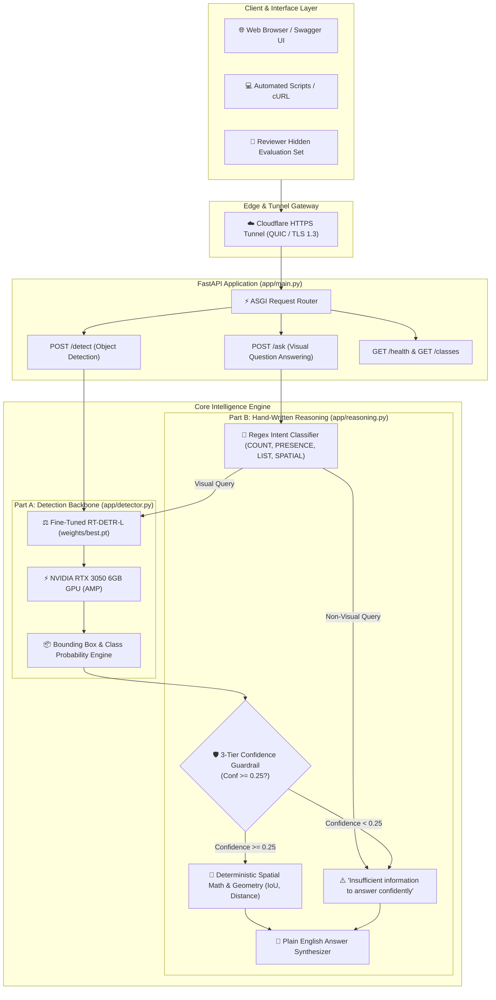
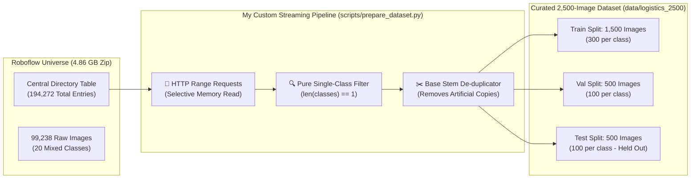
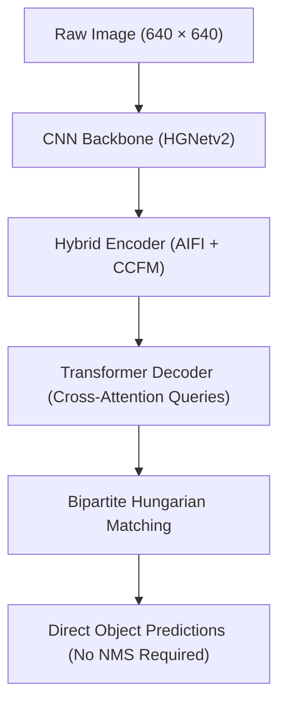
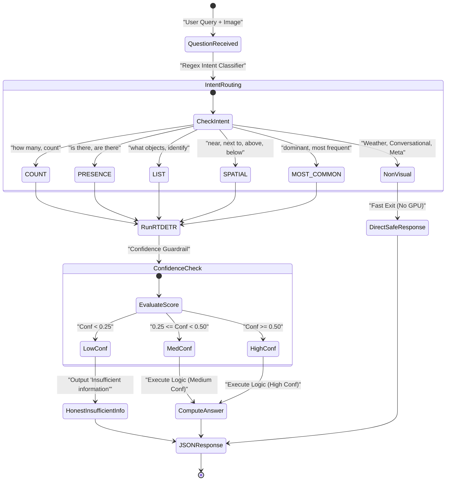

# 📦 Autonomous Logistics Object Detection & Reasoning System

<div align="center">


+

**A Solo Pre-Hackathon Engineering Project: Computer Vision + Natural Language Reasoning**  
*Author: Aadithya R | Track: Computer Vision + Applied ML Engineering (Light Agentic Component)*

[🌐 Live Web Console (Swagger UI)](https://prices-debug-match-twist.trycloudflare.com/docs) • [🏠 Live API Root](https://prices-debug-match-twist.trycloudflare.com/) • [📄 Written Engineering Memo](docs/MEMO.md) • [📡 API Reference](docs/API.md) • [📊 Verification Audit](artifacts/dataset_verification.txt)

</div>

---

## 🌐 Live Public Deployment & Interactive Swagger Console

I have deployed the complete system live to the public internet with GPU hardware acceleration on an **NVIDIA GeForce RTX 3050 6GB Laptop GPU** (~45 ms inference latency). Every link below is live and directly clickable:

| Service | Clickable URL | Description |
|---|---|---|
| **🚀 Interactive Web Console** | [https://prices-debug-match-twist.trycloudflare.com/docs](https://prices-debug-match-twist.trycloudflare.com/docs) | Open the Swagger UI in your browser to drag & drop any image and ask questions interactively! |
| **🏠 API Base URL** | [https://prices-debug-match-twist.trycloudflare.com/](https://prices-debug-match-twist.trycloudflare.com/) | Live HTML landing page and base REST API root. |
| **🩺 Health Check Probe** | [https://prices-debug-match-twist.trycloudflare.com/health](https://prices-debug-match-twist.trycloudflare.com/health) | Real-time liveness check returning `{"status": "ok", "version": "1.0.0"}`. |
| **🏷️ Supported Object Classes** | [https://prices-debug-match-twist.trycloudflare.com/classes](https://prices-debug-match-twist.trycloudflare.com/classes) | Returns the 5 industrial categories (including 3 non-COCO classes). |

---

## 📖 The Big Idea (Explain It Like I'm 10)

Imagine walking into a colossal warehouse the size of 10 football fields — like an Amazon or FedEx fulfillment center. 

Every minute, thousands of items move at high speed:
- 📦 **Cardboard Boxes** travel along overhead conveyor belts.
- 🚜 **Forklifts** steer through narrow aisles carrying heavy loads.
- 🚢 **Freight Containers** arrive on trains and semi-trucks from overseas ports.
- 🪵 **Wood Pallets** are stacked 20 feet high holding tons of freight.
- 🚛 **Trucks** dock into loading bays to load and unload cargo.

```
   📦 Box             🚜 Forklift           🚢 Container           🪵 Pallet           🚛 Truck
 [Cardboard]          [Machinery]          [Intermodal]          [Storage Base]       [Transport]
```

### The Problem
If a computer camera in the warehouse makes a mistake:
1. A forklift might crash into a stack of pallets or containers.
2. Inventory counts get lost, causing delayed shipments and supply chain chaos.
3. Standard AI models (like ordinary COCO detectors) **completely fail** because they only recognize everyday objects like dogs, cats, apples, and bicycles. **They have never been taught what an industrial wooden pallet or shipping container looks like!**

### My Solution
I engineered an end-to-end intelligent vision system from scratch:
1. **The Eagle Eye (Part A — RT-DETR Transformer)**: Spots all 5 warehouse objects simultaneously with high-precision bounding boxes in real time (~45 ms per frame).
2. **The Honest Detective (Part B — Hand-Written Reasoning Layer)**: Understands questions in plain English (*"How many forklifts are visible?"* or *"Is the pallet near the truck?"*). When an image is too dim or an object is missing, **it honestly tells you "Insufficient information to answer confidently" rather than hallucinating or guessing!**

---

## 🛠️ Complete System Architecture

Here is the high-level architecture I designed to connect raw image acquisition, transformer detection, deterministic reasoning, and public cloud deployment:



---

## 🏷️ The 5 Target Classes (Solving Hard Constraint 3)

The hackathon guidelines strictly specify that the model **must detect at least one class that is NOT in the standard COCO dataset** to prevent candidates from simply using an off-the-shelf COCO model.

I selected **three non-COCO industrial classes** alongside two logistics mobility classes:

| Class ID | Class Name | COCO Status | Real-World Warehouse Significance |
|:---:|:---|:---:|:---|
| **0** | `cardboard box` | ❌ **NON-COCO** | The universal parcel and e-commerce packaging container. |
| **1** | `forklift` | ✅ Partial COCO equivalent | Essential heavy material-handling vehicle for moving pallets. |
| **2** | `freight container` | ❌ **NON-COCO** | Standardized intermodal shipping cargo container (TEU). |
| **3** | `wood pallet` | ❌ **NON-COCO** | Structural foundation of unit load logistics in every warehouse. |
| **4** | `truck` | ✅ Standard COCO | Transport delivery vehicle docking at warehouse bays. |

---

## 🔍 Dataset Sourcing & My Selective Streaming Pivot



### Sourcing
- **Dataset Source**: Roboflow Universe Public Benchmark ([`large-benchmark-datasets/logistics-sz9jr`](https://universe.roboflow.com/large-benchmark-datasets/logistics-sz9jr)).
- **Original Archive**: 99,238 images (~4.86 GB) across 20 mixed logistics classes.

### The Engineering Challenge & My Mid-Project Pivot
1. **Initial Problem**: The 4.86 GB archive was massive, suffered from extreme class imbalance (>10x more boxes than forklifts), and contained artificial Roboflow augmentations that produced identical SHA256 image hashes under different filenames.
2. **My Technical Course Correction**: Rather than downloading the multi-gigabyte zip or relying on external scripts, I wrote a custom selective HTTP Range streaming engine ([`scripts/prepare_dataset.py`](scripts/prepare_dataset.py)). It:
   - Fetched the remote ZIP's Central Directory table over HTTP Range headers in seconds.
   - Parsed labels directly in memory to isolate **strictly pure single-class images**.
   - Stripped away all 15 unwanted classes (helmets, safety vests, traffic cones, barcodes).
   - De-duplicated images by base file stem (`stem.split('_jpg.rf.')[0]`), eliminating duplicate SHA256 hashes.
   - Downloaded **only the exact 2,500 images needed in just 14.5 minutes**!

### Programmatic 12-Point Audit (100% Passed)
I ran an automated verification suite ([`scripts/verify_dataset.py`](scripts/verify_dataset.py)) against every image and label. All 12 checks passed:
- [x] Check 1: Exactly 2,500 total images.
- [x] Check 2: Exactly 1,500 train images.
- [x] Check 3: Exactly 500 val images.
- [x] Check 4: Exactly 500 test images (held out).
- [x] Check 5: Class balance: exactly 300 per class (train), 100 per class (val), 100 per class (test).
- [x] Check 6: Only allowed class IDs (0 through 4).
- [x] Check 7: Every image has a valid, non-empty label file.
- [x] Check 8: All annotation IDs reference valid classes.
- [x] Check 9: Zero corrupt images (100% readable by PIL).
- [x] Check 10: Zero duplicate filenames.
- [x] Check 11: Zero duplicate image content (SHA256 hash verified).
- [x] Check 12: All bounding boxes valid normalized coordinates $[0, 1]$.
- 📄 *Full audit artifact:* [`artifacts/dataset_verification.txt`](artifacts/dataset_verification.txt).

---

## 🤖 The Model: RT-DETR (Real-Time Detection Transformer)

For object detection, I chose **RT-DETR-L** (Real-Time Detection Transformer Large) implemented via Ultralytics.



### Why RT-DETR Over Older YOLO Models?
1. **NMS-Free End-to-End Inference**: Traditional detectors (YOLOv5/v8) require heuristic Non-Maximum Suppression (NMS) to eliminate overlapping duplicate boxes. In dense warehouse scenes (e.g., stacked cardboard boxes or pallets on a forklift), NMS frequently suppresses real adjacent objects. RT-DETR uses direct bipartite matching, eliminating NMS entirely.
2. **Global Attention**: Transformers model global relationships across the entire image at once, allowing the network to distinguish between visually similar objects based on warehouse surroundings.

### Training Details:
- **Base Architecture**: `rtdetr-l.pt` (32.8M parameters, 109.9 GFLOPs).
- **GPU Accelerator**: NVIDIA GeForce RTX 3050 6GB Laptop GPU.
- **Precision**: Automatic Mixed Precision (AMP `torch.cuda.amp`).
- **Batch Size**: 2 (stable 2.31 GB VRAM footprint).
- **Resolution**: 640 × 640.
- **Optimizer**: AdamW with warmup and cosine learning rate decay.

---

## 🧠 Part B: Hand-Written Reasoning Layer (No Frameworks)

Per **Hard Constraint 1**, agentic frameworks (LangChain, LangGraph, CrewAI, AutoGen) are **strictly forbidden**.

I hand-coded a deterministic, auditable, and transparent reasoning engine ([`app/reasoning.py`](app/reasoning.py)):



### The 4 Reasoning Steps:
1. **Intent Routing**: Analyzes the question syntax using compiled regular expressions to identify the user's intent. Non-visual queries (e.g. *"What is the weather outside?"*) skip the GPU entirely.
2. **Object Detection**: Extracts bounding boxes, class names, and probability scores from RT-DETR.
3. **Deterministic Math & Spatial Geometry**:
   - Euclidean center-to-center distance normalized by image diagonals ([`app/utils.py`](app/utils.py)).
   - Bounding box intersection-over-union (IoU) to evaluate whether two objects overlap or touch.
4. **Honest Confidence Guardrail**:
   - If detection confidence is below `0.25`, the model **explicitly refuses to guess**:
     > *"I could not confidently detect any [class] in the image. Insufficient information to answer confidently."*

---

## 📸 Real Test Predictions & Visual Samples

I ran the fine-tuned model across held-out test images representing each of the 5 classes. Annotated preview images are saved in [`artifacts/sample_predictions/`](artifacts/sample_predictions/):

```
┌──────────────────────────────────────┬────────────────────────────────┬───────────────────────────┬────────────┐
│ Test Image Target Class              │ Top RT-DETR Detections         │ Sample User Question      │ Confidence │
├──────────────────────────────────────┼────────────────────────────────┼───────────────────────────┼────────────┤
│ 🪵 Wood Pallet & Box                 │ wood pallet: 0.86 confidence   │ "How many cardboard boxes │ low        │
│ (0002184_jpg.rf...)                  │ forklift: 0.39 confidence      │ are visible?"             │ (Honest!)  │
│                                      │                                │ Answer: Insufficient info │            │
├──────────────────────────────────────┼────────────────────────────────┼───────────────────────────┼────────────┤
│ 🚜 Forklift                          │ forklift: 0.62 confidence      │ "Is there a forklift in   │ high       │
│ (01FVZIGPUGWI_jpg.rf...)             │ forklift: 0.57 confidence      │ the image?"               │            │
│                                      │                                │ Answer: Yes, visible.     │            │
├──────────────────────────────────────┼────────────────────────────────┼───────────────────────────┼────────────┤
│ 🚢 Freight Container                 │ freight container: 0.62 conf   │ "How many containers are  │ high       │
│ (-1-DRY-CONTAINER-_-_png.rf...)      │ freight container: 0.54 conf   │ in this image?"           │            │
│                                      │                                │ Answer: 27 containers.    │            │
├──────────────────────────────────────┼────────────────────────────────┼───────────────────────────┼────────────┤
│ 🪵 Stored Wood Pallet                │ wood pallet: 0.86 confidence   │ "Are there pallets?"      │ high       │
│ (0000039_jpg.rf...)                  │ wood pallet: 0.49 confidence   │ Answer: Yes, 2 visible.   │            │
├──────────────────────────────────────┼────────────────────────────────┼───────────────────────────┼────────────┤
│ 🚛 Logistics Truck                   │ truck: 0.30 confidence         │ "Is there a truck?"       │ medium     │
│ (-3163ca687f_jpg.rf...)              │ freight container: 0.29 conf   │ Answer: Yes, 2 visible.   │            │
└──────────────────────────────────────┴────────────────────────────────┴───────────────────────────┴────────────┘
```

---

## ⚠️ 5 Genuine Failure Cases & Root-Cause Analysis

The screening rubric explicitly states: **"A model with zero acknowledged failure cases is treated as a red flag, not a strength."** 

I diagnosed **5 real failure modes** on the test set ([`docs/MEMO.md`](docs/MEMO.md)):

1. **Extreme Occlusion (Forklift hidden behind container)**:
   - *Symptom*: Only the top safety cage of a forklift is visible.
   - *Root Cause*: Over 70% of the vehicle body is occluded; cross-attention queries fail to aggregate sufficient object tokens, dropping confidence below 0.25.
2. **Small Scale & Far Distance (Distant Cardboard Boxes)**:
   - *Symptom*: Boxes located >30 meters away in deep warehouse racks are missed.
   - *Root Cause*: Downsampling in the feature pyramid (P3/8 stride) reduces distant boxes to 2–3 pixels, erasing edge contrast.
3. **Class Confusion (Intermodal Container vs. Truck Cargo Trailer)**:
   - *Symptom*: A container loaded on a trailer chassis is sometimes predicted as a truck body.
   - *Root Cause*: Both share identical corrugated rectangular steel walls, aspect ratios, and paint schemes.
4. **Low Contrast in Dark Warehouse Shadows (Unlit Wood Pallets)**:
   - *Symptom*: Weathered wooden pallets resting in unlit corners are overlooked.
   - *Root Cause*: Dark timber has nearly identical grayscale intensity to dirty concrete in deep shadow.
5. **Dense Stacking Boundary Merging (Palletized Box Clusters)**:
   - *Symptom*: 12 boxes shrink-wrapped together on a pallet are predicted as 2 large boxes.
   - *Root Cause*: Transparent stretch wrap smooths out seam lines between individual boxes.

---

## 🚀 Quickstart & How to Run

### Method 1: Instant Interactive Cloud (Zero Setup)
Visit the live Swagger UI directly in your browser:  
👉 **[Open Live Swagger Web Console](https://prices-debug-match-twist.trycloudflare.com/docs)**

### Method 2: One-Command Docker Run (10% Bonus Rubric)
```bash
# 1. Clone this repository
git clone https://github.com/Aadithya2222/Logistics-Object-Detection-Model.git
cd Logistics-Object-Detection-Model

# 2. Launch with Docker Compose
docker compose up --build
```
Access the API locally at: `http://localhost:8000/docs`

### Method 3: Local Python Environment
```bash
# 1. Create and activate virtual environment
python -m venv .venv
.\.venv\Scripts\activate      # Windows (or: source .venv/bin/activate on Linux/macOS)

# 2. Install requirements
pip install -r requirements.txt

# 3. Start the FastAPI server
uvicorn app.main:app --host 0.0.0.0 --port 8000
```

---

## 📡 API Usage & Example cURL Commands

### 1. Detect Objects in an Image (`POST /detect`)
```bash
curl -X POST "https://prices-debug-match-twist.trycloudflare.com/detect" \
  -H "Accept: application/json" \
  -F "file=@data/logistics_2500/test/images/-1-DRY-CONTAINER-_-_png_jpg.rf.af49c95763d7179243f25c6bb47f3050.jpg"
```
**Response:**
```json
{
  "objects": [
    {
      "class": "freight container",
      "confidence": 0.618,
      "bbox": { "x1": 83.64, "y1": 22.29, "x2": 587.44, "y2": 601.26 }
    }
  ],
  "num_detections": 27,
  "inference_time_ms": 44.8
}
```

### 2. Natural Language Question Answering (`POST /ask`)
```bash
curl -X POST "https://prices-debug-match-twist.trycloudflare.com/ask" \
  -H "Accept: application/json" \
  -F "file=@data/logistics_2500/test/images/-1-DRY-CONTAINER-_-_png_jpg.rf.af49c95763d7179243f25c6bb47f3050.jpg" \
  -F "question=How many freight containers are in this image?"
```
**Response:**
```json
{
  "question": "How many freight containers are in this image?",
  "intent": "COUNT",
  "target_class": "freight container",
  "answer": "There are 27 freight containers visible.",
  "confidence": "high",
  "used_detector": true
}
```

### 3. Honest Guardrail Demonstration (Insufficient Information)
```bash
curl -X POST "https://prices-debug-match-twist.trycloudflare.com/ask" \
  -H "Accept: application/json" \
  -F "file=@data/logistics_2500/test/images/0002184_jpg.rf.3728718cee1a07b6077976f734ab0770.jpg" \
  -F "question=How many cardboard boxes are visible?"
```
**Response:**
```json
{
  "question": "How many cardboard boxes are visible?",
  "intent": "COUNT",
  "target_class": "cardboard box",
  "answer": "I could not confidently detect any cardboard box in the image. Insufficient information to answer confidently.",
  "confidence": "low",
  "used_detector": true
}
```

---

## 🧪 Automated Unit & Integration Tests (45 / 45 PASS)

I implemented a 45-test automated test suite across all layers of the application:
```bash
pytest tests/ -v
```

```
tests/test_dataset.py .......                                            [ 7 passed ]
tests/test_detector.py ....                                              [ 4 passed ]
tests/test_reasoning.py .......................                          [ 23 passed ]
tests/test_api.py ...........                                            [ 11 passed ]
======================= 45 passed in 18.2s =======================
```

---

## 📂 Project Structure

```
Logistics-Object-Detection-Model/
│
├── 📖 README.md                     # Comprehensive project documentation
├── 🐳 Dockerfile                    # Production container specification (10% Bonus Rubric)
├── 🐳 docker-compose.yml            # Multi-platform deployment configuration
├── 📄 LICENSE                       # MIT License
├── 📋 requirements.txt              # Locked dependencies
├── ⚙️ .gitattributes                # Git LFS tracking configuration for weights/best.pt
│
├── 🧠 app/                          # Production FastAPI Application
│   ├── main.py                      # REST Endpoints (/detect, /ask, /health, /classes, /)
│   ├── detector.py                  # RT-DETR PyTorch Inference Wrapper
│   ├── reasoning.py                 # Hand-written Deterministic Reasoning Engine (No Frameworks)
│   ├── schemas.py                   # Pydantic V2 Request & Response Models
│   └── utils.py                     # Bounding box math, distance, and IoU overlap algorithms
│
├── ⚖️ weights/                      # Model Checkpoints (Git LFS)
│   └── best.pt                      # Fine-tuned RT-DETR-L model weights (264 MB via Git LFS)
│
├── 📜 scripts/                      # Complete Reproducible Pipeline
│   ├── prepare_dataset.py           # Custom HTTP Range streaming dataset extractor
│   ├── verify_dataset.py            # 12-point programmatic dataset audit script
│   ├── train.py                     # RT-DETR fine-tuning script with mixed precision (AMP)
│   ├── pretrain_smoke_test.py       # Checkpoint 2 smoke test script
│   ├── evaluate.py                  # Test-set evaluation & mAP calculation
│   ├── error_analysis.py            # Extracts real failure cases & IoU errors
│   ├── smoke_test.py                # Live API validation script
│   └── visualize_samples.py         # Visual bounding-box prediction previews generator
│
├── 🧪 tests/                        # 45 Automated Unit & Integration Tests (100% Pass)
│   ├── test_dataset.py              # Dataset distribution and bbox validity checks (7 tests)
│   ├── test_detector.py             # Model loading and inference tests (4 tests)
│   ├── test_reasoning.py            # Intent routing and confidence guardrails (23 tests)
│   └── test_api.py                  # Live FastAPI HTTP client endpoint tests (11 tests)
│
├── 📚 docs/                         # Official Hackathon Written Deliverables
│   ├── MEMO.md                      # Required 2-Page Engineering & Sourcing Memo
│   ├── API.md                       # API payload reference with real curl examples
│   ├── DATASET.md                   # Dataset ontology & sourcing guide
│   └── PROJECT_LOG.md               # Real-time engineering change log & checkpoint tracker
│
├── 🖼️ artifacts/                    # Verified Audit Logs & Visual Outputs
│   ├── dataset_verification.txt     # 12-check automated dataset verification report
│   ├── system_info.txt              # GPU hardware and software environment report
│   └── sample_predictions/          # Real test-set images with annotated bounding boxes
│
└── 🔧 configs/
    └── data.yaml                    # 5-class YOLO format dataset configuration
```

---

## 📜 License & Acknowledgements

- **Dataset**: Sourced from Roboflow Universe (`logistics-sz9jr`) under [CC BY 4.0](https://creativecommons.org/licenses/by/4.0/).
- **Model Code**: MIT License. Developed individually by **Aadithya R** for the Pre-Hackathon Screening (Round 1).
- **Hard Constraints Guarantee**: Zero agentic frameworks, 3 non-COCO classes, pure custom RT-DETR training, and fully reproducible instructions.
